# 1. 서비스 소개

## 서비스 개요

- **진행 기간** : **2022.07.11 ~ 2022.08.19(6주)**
- 한 줄 소개 : 면접 스터디 + AI 면접 분석
- 서비스 명 : **urin**

## 기획 배경

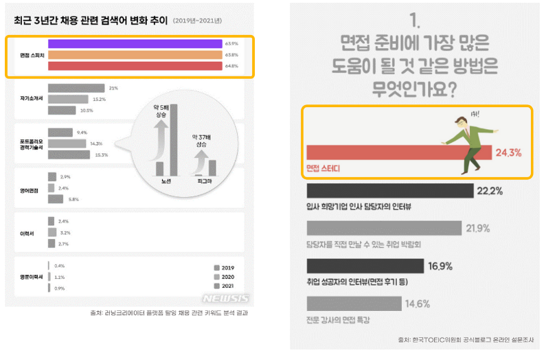

**취업을 준비하는 사람들은 면접 역량을 가장 중요하게 생각한다. 면접 스터디에 대한 관심도 매우 높지만, 스터디를 구할 마땅한 방법이 없다.  따라서 면접 스터디에 대한 높은 수요를 원활하게 해결하고 적절한 면접 스터디를 진행 할 수 있는 면접 스터디 플랫폼을 제공해주는 서비스를 기획하게 되었다.**

 **면접 스터디를 진행할 때 마다 같은 스터디원의 피드백 뿐만 아니라 AI의 피드백을 레포트로 제공 받아 나의 현재 면접 역량을 파악 및 개선할 수 있다.**

## 타겟

1. **면접에 대비하고 싶은 취업 준비생**
2. **면접 전형 탈락의 원인 파악이 힘든 사람**

# 2. 프로젝트 예시

## 서비스 인트로

- 카카오 로그인
- 스터디 제목 & 해시태그 검색

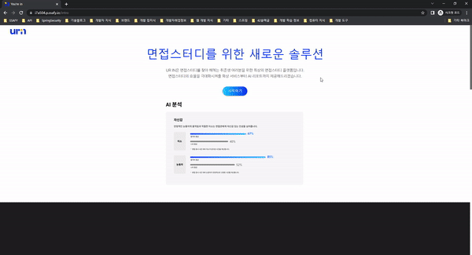

## 면접 스터디 진행 화면

- 화상미팅에 2가지 모드가 존재 (일반, 면접 모드)
- 면접 모드는 면접을 위한 기능이 존재한다. 면접자를 한 명 선택 가능
    - 면접 시작 버튼을 누르면 타이머로 면접 진행 시간 파악 가능
    - 추가로 AI가 면접자의 표정 & 자세를 분석
- 면접 진행하며 평가자 역할을 맡은 사람들은 피드백을 작성 가능


## AI 분석 & 평가자 피드백 Report

- 면접 모드에서 면접자의 표정 & 자세를 AI가 분석한 결과와 평가자들이 작성한 피드백들을 Report에서 한 눈에 볼 수 있다.

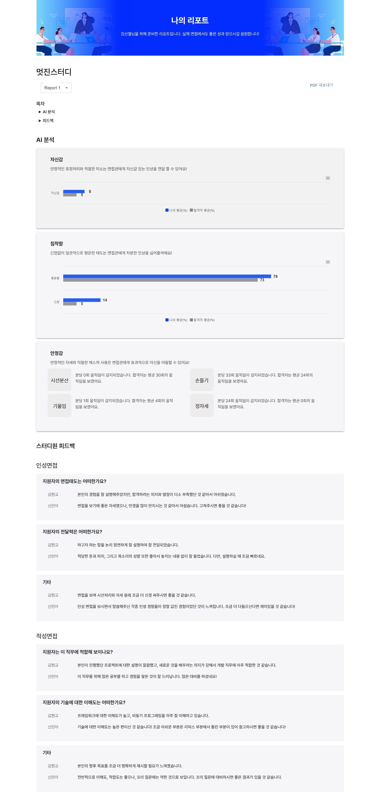

# 3. 기획

## ERD
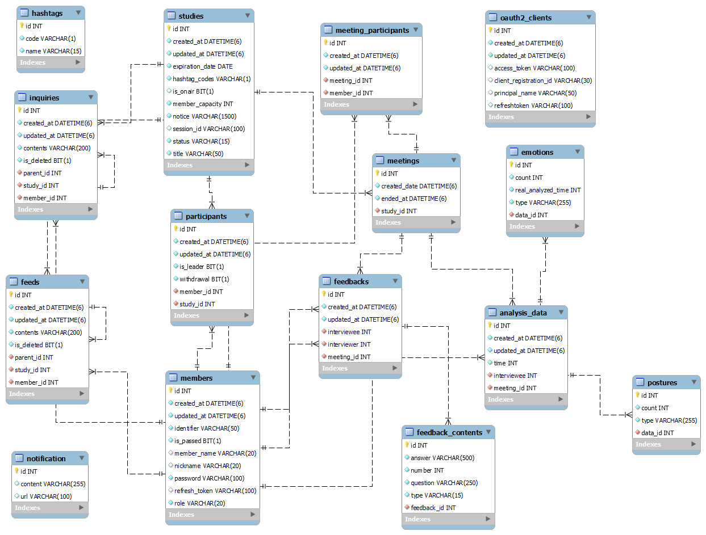

## Figma
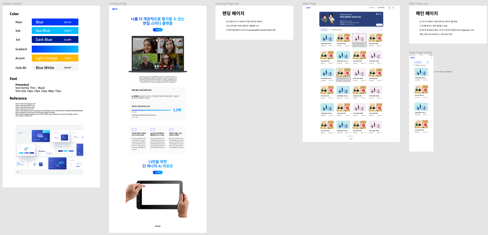
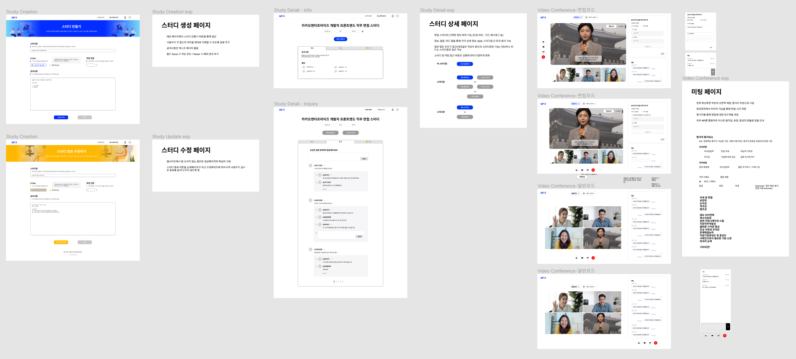
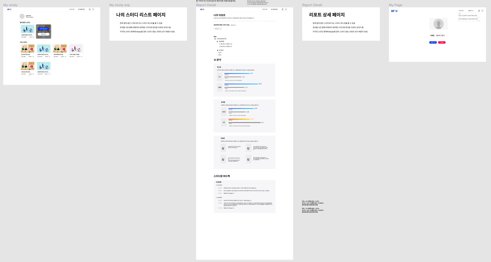

## API 명세

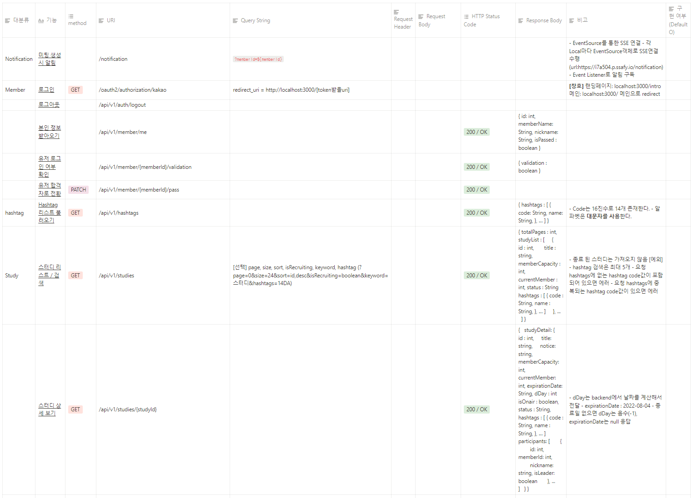


# 4. 기술 스택 및 배포 환경


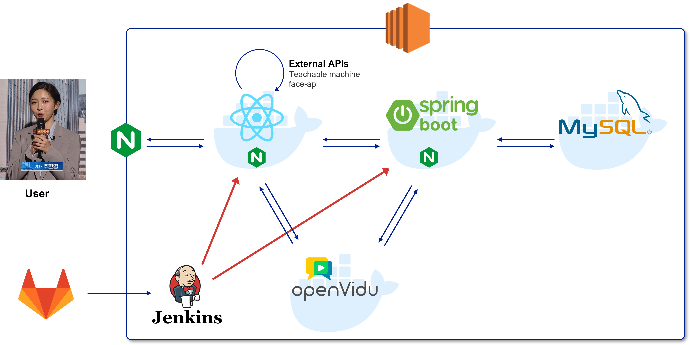

## Frontend

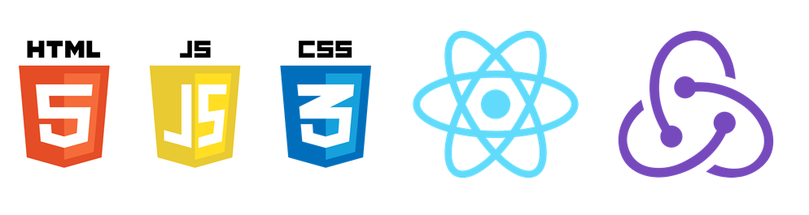

`prettier`와 `eslint`로 코드 스타일 통일(Airbnb style)
`redux`, `reduxjs/toolkit`, `react-router-dom v6`  사용

- OpenVidu  
OpenVidu is a platform to facilitate the addition of video calls in your web or mobile application.  
    
`WebRTC`를 보다 간단하게 적용할 수 있고, 다양한 프레임워크와 호환성이 높은 `openvidu`를 사용하여 프로젝트를 진행했습니다. `openvidu tutorial`의 `openvidu-call-react`의 소스 코드를 기반으로 화상회의를 구현하였습니다
    

- face-api  
JavaScript face recognition API for the browser and nodejs implemented on top of tensorflow.js core  

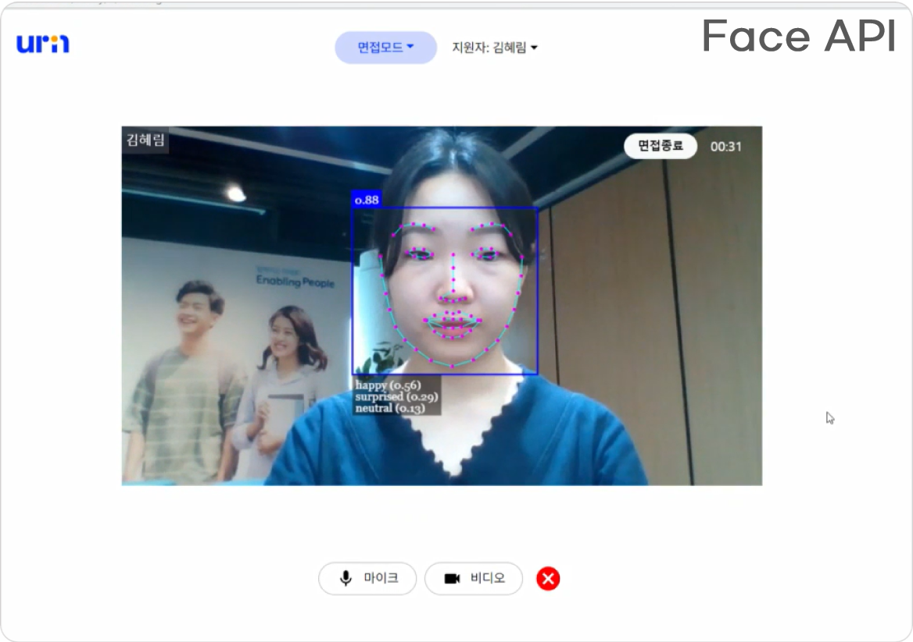
    
    
`urin` 에서는 `face api`의 다양한 기능 중 `Face Detection` 을 통해 얼굴을 감지하고 `Face Expression Recognition`을 이용해 면접자의 감정을 분석합니다. 
    
- Teachablemachine/pose  
Teachable Machine은 누구나 머신러닝 모델을 쉽고 빠르고 간단하게 만들 수 있도록 제작된 웹 기반 도구입니다.  

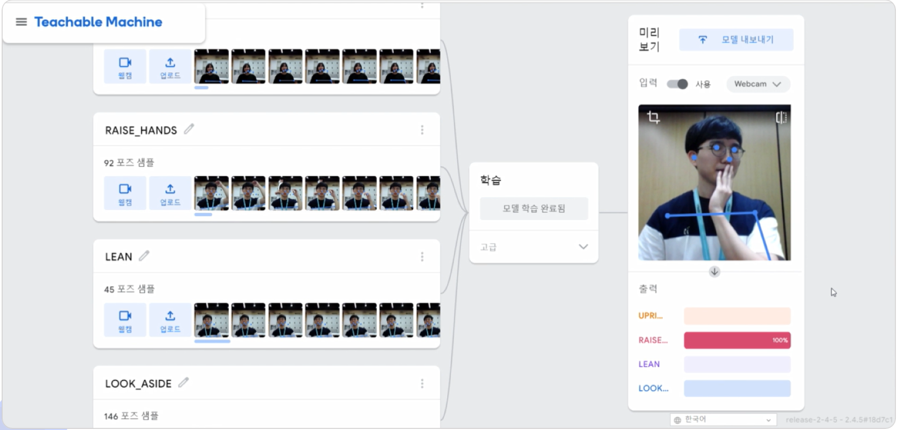

        
`urin`에서는 `Teachablemachine`의 `pose` 라이브러리를 이용해 면접자의 자세를 인식합니다.
    

## Backend

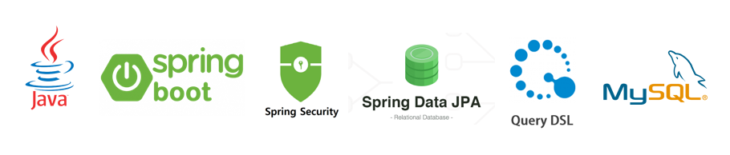

## CI & CD

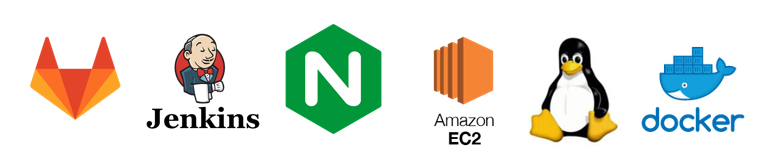

## Version

### Frontend

- NodeJS : 16.16.0
- React : 18.2.0
    - React-redux : 8.0.2
    - React-router-dom : 6.3.0
- face-api.js : 0.22.0
- teachablemachine/pose : 0.8.6

### Backend

- JAVA : JDK 11
- Spring Boot : 2.6.10
- MySQL :  8.0.29

### CI / CD

- Ubuntu : 20.04 LTS
- Docker : 20.10.12
- Nginx : 1.18.0
- Jenkins : 2.346.2

# 5. 프로젝트 진행


## Git Flow

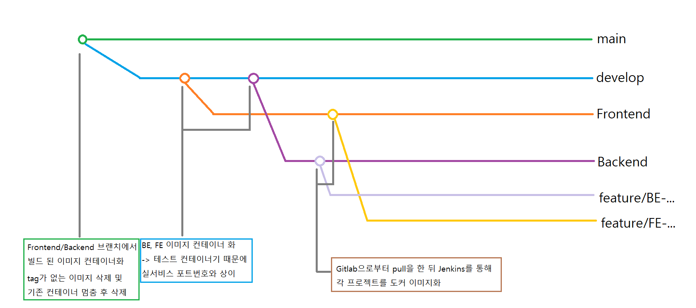

git flow 전략과 github flow 전략 중 git flow 전략을 채택했습니다. `feature`브랜치에서 작업 후`fronend` or `backend`브랜치로 Merge Request를 생성했습니다.

MR은 코드 리뷰를 거쳐 본인이 아닌 사람이 MR을 승인해 주었습니다. `frontend`와 `backend`에 쌓인 commit은 배포할 준비가 되면 `develop`, `main` 브랜치에 반영했습니다.
commit message는 `(gitmoji) <타입> : <제목> <#이슈번호>` 형태로 통일하여 작성했습니다

```java
# (gitmoji) <타입> : <제목> <#이슈번호>

##### 제목은 이슈 번호와 함께 최대 50 글자까지 한 줄로 입력 ############## -> |

# 본문은 위에 작성
######## 본문은 한 줄에 최대 72 글자까지만 입력 ########################### -> |

# --- COMMIT END ---
# <타입> 리스트
#   ✨(:sparkles:) feat   : 기능 (새로운 기능)
#   🐛(:bug:) fix         : 버그 (버그 수정)
#   ♻(:recycle:) refactor : 리팩토링
#   💄(:lipstick:) style   : 스타일 (코드 형식, 세미콜론 추가: 비즈니스 로직에 변경 없음)
#   📝(:memo:) docs        : 문서 (문서 추가, 수정, 삭제)
#   ✅(:white_check_mark:) test : 테스트 (테스트 코드 추가, 수정, 삭제: 비즈니스 로직에 변경 없음)
#   🔨(:hammer:) chore     : 기타 변경사항 (빌드 스크립트 수정 등)
# ------------------
#     제목은 명령문으로
#     제목 끝에 마침표(.) 금지
#     제목과 본문을 한 줄 띄워 분리하기
#     본문은 "어떻게" 보다 "무엇을", "왜"를 설명한다.
#     본문은 한 줄을 작성하고 . 마침표를 찍어서 분리한다.
# ------------------

```

## Jira

- 매 주 월요일, 주간 회의를 통해 한 주 간의 목표를 정하고 Sprint를 생성
- 초반에는 일정에 맞춰 Epic 생성
- JIRA 피드백 이후 핵심 기능 별 Epic생성

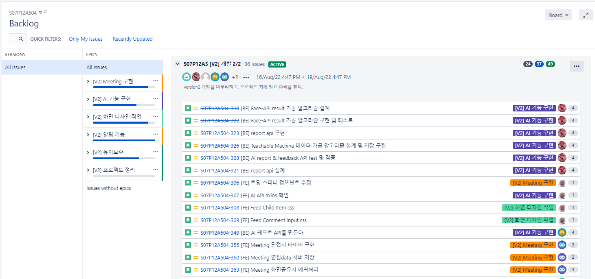

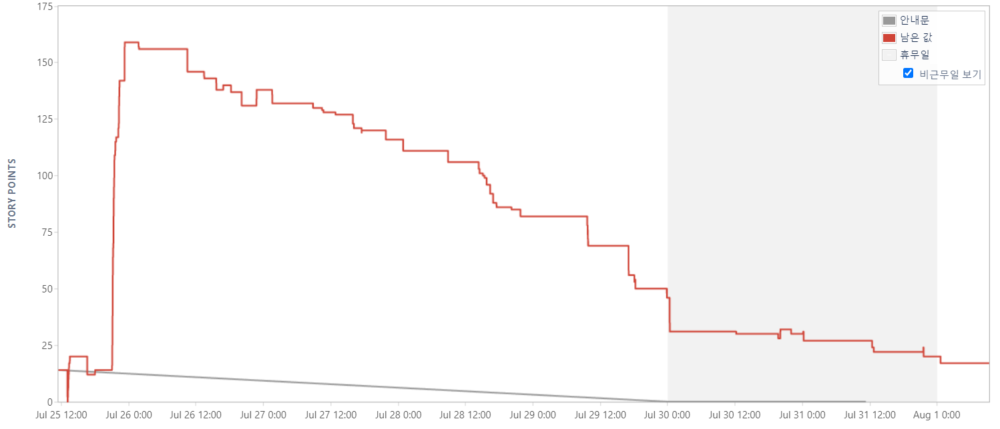

## Notion

### 1) 회의록

- 매일 아침마다 어제 했던 일, 오늘의 계획을 공유하는 Daily Scrum을 진행
- 각 회의 내용을 Tag로 분류한 회의록에 상세히 기록

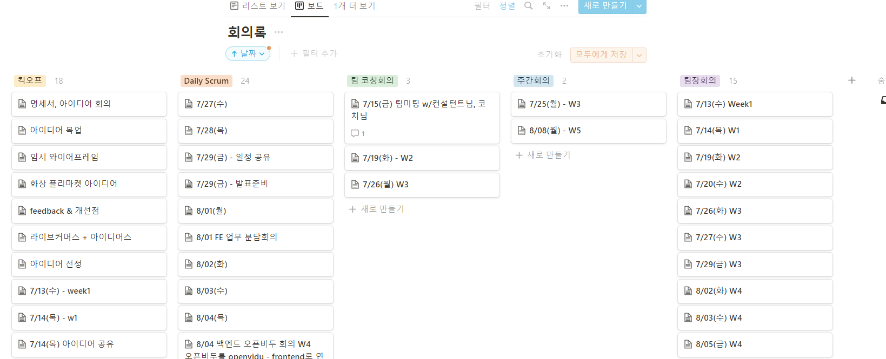

### 2) 자료 공유 (Wiki)

- 중요한 자료를 한 곳에서 관리

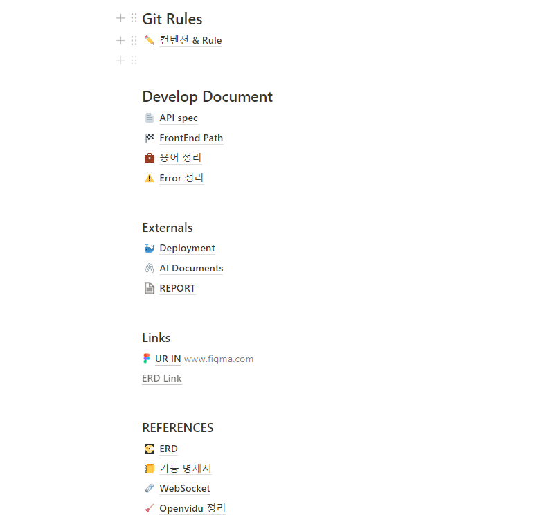

# 6. 타임라인


### **1주차(7/11 ~ 7/15)**

- 아이디어 회의 & 선정

### **2주차(7/18 ~ 7/22)**

- Ver1(서비스 핵심 기능) 기획
- ERD, Wireframe, 기능 정의서 작성

### **3주차(7/25 ~ 7/29)**

- [FE] 컴포넌트 구조도 작성 & HTML 개발
- [BE] CI / CD 구축
- [BE] API 개발

### **4주차(8/1 ~ 8/5)**

- [FE] Redux, Axios
- [BE] 소셜 로그인 & API 예외 처리
- [BE] 서비스 배포

### **5주차(8/8 ~ 8/12)**

- Ver2(서비스 특화 기능) 기획
- [FE] OpenVidu 추가
- [FE] Face-API, Teacherable-Machine 추가
- [BE] Ver2 API 개발 & Ver1 API 유지 보수

### **6주차(8/16 ~ 8/19)**

- Ver2 개발 마무리
- UCC 제작, 발표 준비, 최종 테스트
- 8/19 최종발표

